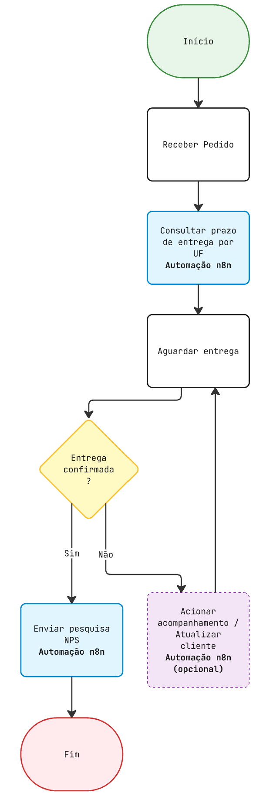
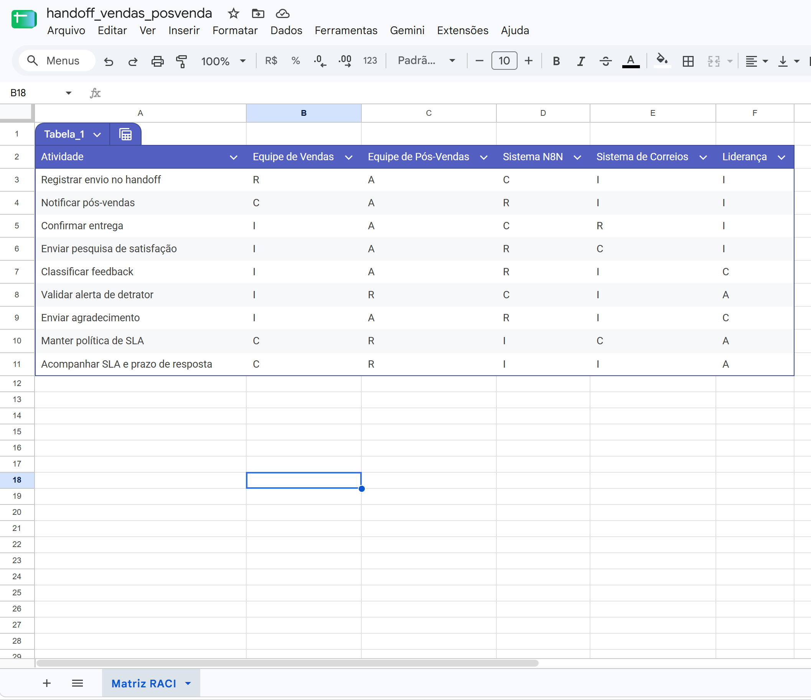
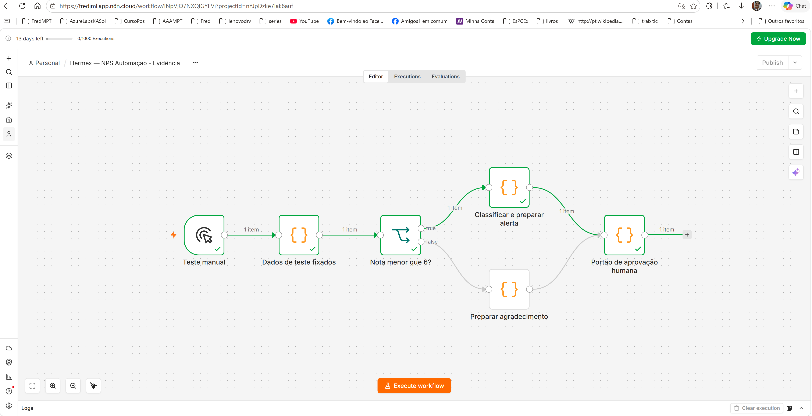
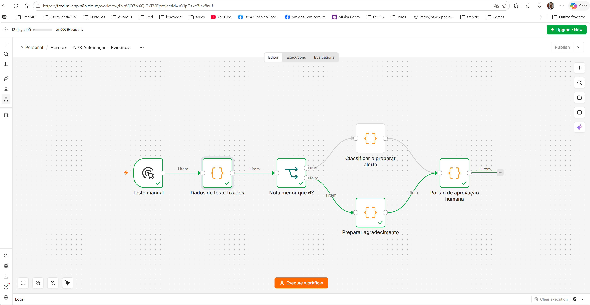
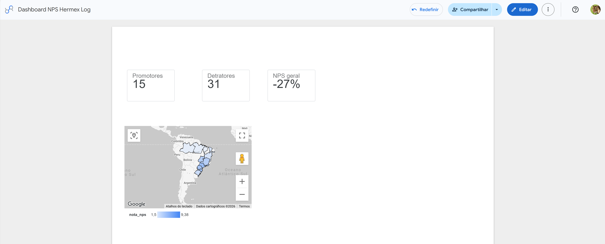
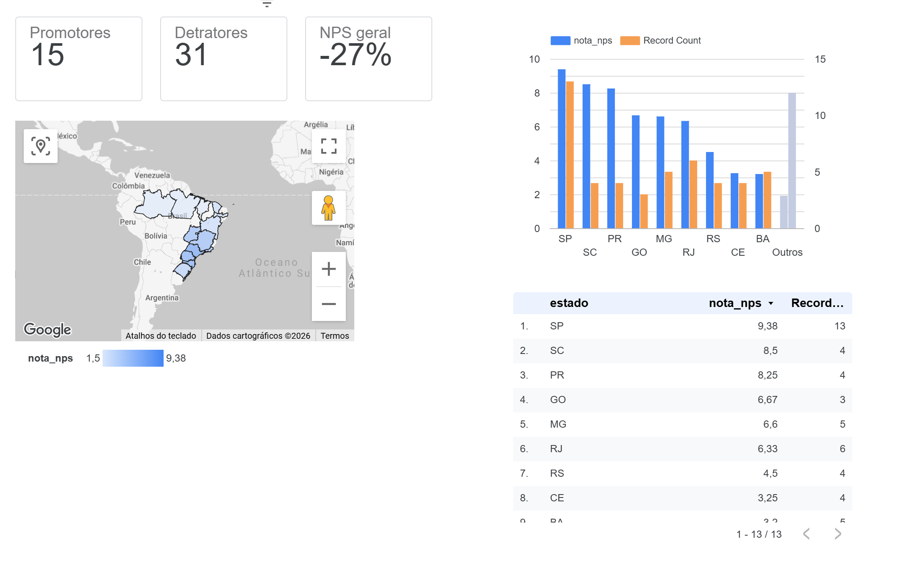
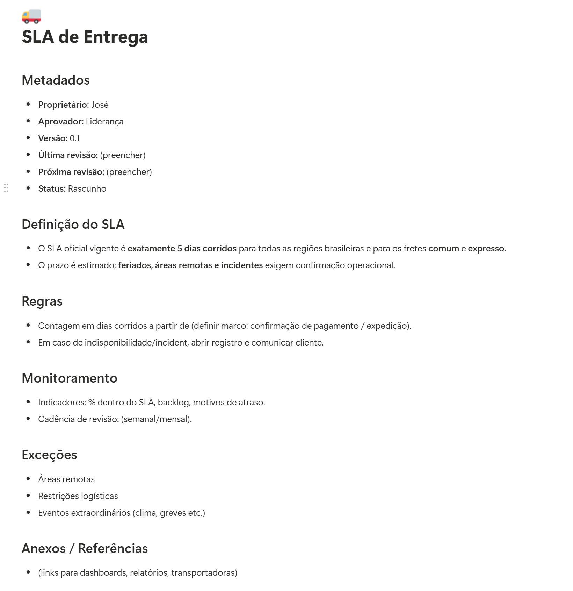

# Hermex Log - Projeto NPS

Implementacao local e reproduzivel do Desafio Hermex Log - Especialista em IA, Nivel 1. O projeto entrega regras de SLA, classificacao de feedback, calculo de NPS, roteamento de mensagens, artefatos importaveis para as plataformas SaaS, evidencias visuais e relatorios de validacao.

## Cenario de negocio

A Hermex Log e uma operacao de logistica que precisa acompanhar a experiencia do cliente apos a entrega dos pedidos. O desafio do projeto e transformar sinais dispersos de atendimento, prazo e satisfacao em um fluxo simples de operacao: consultar prazo prometido, registrar handoff entre vendas e pos-vendas, captar feedback do cliente, identificar rapidamente detratores e consolidar tudo em um painel gerencial.

Do ponto de vista de negocio, este projeto responde a tres dores principais:

- falta de padronizacao do SLA por estado;
- demora para acionar pos-vendas quando um cliente relata atraso, defeito ou falha operacional;
- ausencia de uma visao consolidada do NPS por estado para orientar decisoes.

O objetivo final foi montar uma solucao auditavel, com automacao controlada e aprovacao humana, capaz de apoiar atendimento, analise e governanca sem expor credenciais no repositorio.

## Perguntas respondidas pelo projeto

Estas foram as perguntas de negocio e implementacao respondidas ao longo da entrega:

1. Como consultar o prazo de entrega por UF de forma padronizada?
2. Como registrar o fluxo de handoff entre vendas e pos-vendas com responsabilidades claras?
3. Como coletar feedback de satisfacao com identificacao do pedido?
4. Como classificar um feedback como detrator para acionar acompanhamento?
5. Como automatizar alertas e mensagens de agradecimento com seguranca?
6. Como consolidar o NPS geral e a leitura por estado em dashboard?
7. Como manter uma base de conhecimento com politicas e SLA acessiveis ao time?
8. Como organizar evidencias suficientes para correcao, mesmo se algum link externo falhar?

## Ferramentas utilizadas

Cada ferramenta foi usada com um papel especifico na solucao:

- `ChatGPT / GPT customizado`: consulta de prazo por UF e testes orientados.
- `Miro`: modelagem visual do fluxo operacional com decisao, loop e automacoes.
- `Google Sheets`: base de handoff, matriz RACI e base consolidada de respostas NPS.
- `Google Forms`: coleta estruturada de satisfacao com `id_pedido`, nota e comentario.
- `n8n`: automacao de classificacao, roteamento de detratores e agradecimentos.
- `Gmail`: evidencia de e-mails de alerta e retorno automatizado.
- `Looker Studio`: dashboard com scorecards, mapa, grafico e tabela por estado.
- `Notion`: base de conhecimento operacional com politicas, reembolso e SLA.
- `Node.js`: implementacao local das regras e scripts reproduziveis.
- `npm test`: validacao automatizada das regras do projeto.

## Pacote para correcao

Este repositorio deve ser entregue junto com os links de leitura das ferramentas externas. Para avaliacao, considere os seguintes itens:

| Item | Caminho | Finalidade | Status |
|---|---|---|---|
| README principal | `README.md` | Guia de correcao, testes e acessos | feito |
| Evidencias detalhadas | `READM.md` | Tabelas de evidencias e criterios de aceite | feito |
| Artefatos SaaS | `artefatos/` | GPT, Miro/Mermaid, RACI, n8n, Looker, Notion e governanca | feito |
| Datasets | `dados/` | CSVs de NPS e handoff | feito |
| Codigo | `src/` | Regras locais e motor de validacao | feito |
| Testes | `test/` | Testes automatizados | feito |
| Relatorio Markdown | `Analise/relatorio_validacao_hermex_log.md` | Relatorio de validacao | feito |
| Relatorio Word | `Analise/relatorio_validacao_hermex_log.docx` | Relatorio final para entrega | feito |
| Capturas | `Analise/evidencias/` | Evidencias visuais quando link publico nao for possivel | feito |
| Dossie final de evidencias | `Analise/Evidencias_Projeto_Hermex_Log.docx` | Documento unico com as capturas organizadas | feito |

## Execucao rapida

```bash
npm test
npm run demo
npm run data
```

Resultado esperado:

| Comando | Resultado esperado |
|---|---|
| `npm test` | 9 testes aprovados, 0 falhas |
| `npm run demo` | Consulta de prazo, detrator, promotor e NPS demonstrados |
| `npm run data` | 60 respostas NPS e 30 registros de handoff validados |

## Como validar a entrega

Para revisar o projeto ponta a ponta sem depender apenas das plataformas externas:

1. Leia este `README.md` para entender o cenario, regras e acessos.
2. Execute `npm test` para validar a implementacao local.
3. Consulte a pasta `artefatos/` para os arquivos prontos de importacao e configuracao.
4. Abra os relatorios em `Analise/` para ver a validacao e a analise executiva.
5. Abra `Analise/Evidencias_Projeto_Hermex_Log.docx` para revisar as evidencias visuais em ordem de correcao.
6. Se necessario, confira tambem as imagens originais em `Analise/evidencias/`.

## Matriz de criterios e evidencias

| Criterio de avaliacao | O que foi entregue | Evidencia principal | Caminho / link de apoio | Status |
|---|---|---|---|---|
| Repositorio GitHub com codigo e documentacao | Projeto versionado com historico de commits e README detalhado | Estrutura completa do repositorio e documentacao central | `README.md` e repositorio GitHub | Concluido |
| Cenario de negocio e perguntas respondidas | Contexto da Hermex Log, objetivos e perguntas analiticas descritas | Secoes explicativas do desafio e das perguntas de negocio | `README.md` | Concluido |
| Fluxo do processo pos-venda | Fluxo desenhado e validado visualmente | Print do fluxo no Miro | `Analise/evidencias/03_miro_fluxograma.png`, `artefatos/02_fluxo_pos_venda.mmd` | Concluido |
| Matriz RACI | Responsabilidades distribuidas entre vendas, pos-venda, n8n, correios e lideranca | Print da planilha com a matriz pronta | `Analise/evidencias/04_sheets_matriz_raci.png`, `artefatos/03_matriz_raci.csv` | Concluido |
| Formulario NPS | Google Forms estruturado com campos e escala de nota | Print do formulario configurado | `Analise/evidencias/05_forms_nps.png` | Concluido |
| Automacao no n8n | Workflow com classificacao de detratores e promotores | Evidencias do fluxo, incluindo caminho detrator e caminho promotor em teste real | `artefatos/05_n8n_workflow.json`, `Analise/evidencias/06_n8n_detrator.png`, `Analise/evidencias/07_n8n_promotor.png` | Concluido |
| Evidencia de e-mail automatizado | Recebimento de alerta / mensagem de teste e disparo do fluxo de agradecimento | Print do e-mail recebido e validacao cruzada com a execucao promotora | `Analise/evidencias/08_gmail_emails_teste.png`, `Analise/evidencias/07_n8n_promotor.png` | Concluido |
| Dashboard analitico | KPIs de NPS, promotores, detratores, mapa e visao por estado | Dois prints cobrindo os principais graficos | `Analise/evidencias/09_looker_dashboard_1.png`, `Analise/evidencias/09_looker_dashboard_2.png`, `artefatos/06_looker_studio.md` | Concluido |
| Base de conhecimento no Notion | Base `Processos Hermex Log` com paginas operacionais e SLA | Print da base e da pagina de SLA | `Analise/evidencias/10_notion_base.png`, `Analise/evidencias/10_notion_base_sla.png`, `artefatos/07_notion_base_conhecimento.md` | Concluido |
| Testes locais | Suite cobrindo regras principais do projeto | Arquivos de teste e comandos de validacao | `test/hermex.test.js`, `package.json` | Concluido |
| Relatorio de correcao com IA | Autoavaliacao com pontos fortes, pontos de atencao e proximos estudos | Relatorio separado para apoiar a correcao | `Analise/relatorio_correcao_ia.md` | Concluido |
| Dossie consolidado de evidencias | Documento final reunindo as evidencias do projeto | Arquivo `.docx` pronto para revisao | `Analise/Evidencias_Projeto_Hermex_Log.docx` | Concluido |
| Pacote final de entrega | Versao auditavel reunida para submissao | Arquivo compactado com todo o material | `Entrega_Hermex_Log_Nivel1_2026-08-21.zip` | Concluido |

## Links de leitura para o professor

Antes de enviar, confirme que os links abaixo estao com permissao de leitura para o professor. Quando a plataforma nao oferecer um link publico de leitura simples, a avaliacao pode seguir pelas evidencias locais do repositorio e pelo dossie `.docx`.

| Entrega externa | Link de leitura | Status |
|---|---|---|
| GPT customizado `Hermex Prazos` | link do editor/admin; validar principalmente pelas capturas `01_gpt_instrucoes.png` e `02_gpt_testes_sp_ba_am.png` | acesso administrativo |
| Board Miro | https://miro.com/app/board/uXjVHwPbfwI=/ | confirmado via MCP |
| Pasta Google Drive `handoff_vendas_posvenda` | https://drive.google.com/drive/folders/1eaeIZOCvHx-dldNU6blgvHKCG-ZX7cyC | confirmado via MCP |
| Google Sheets `handoff_vendas_posvenda` | https://docs.google.com/spreadsheets/d/15ldumkb96Aqlqd3KOvBzwO2g-xKyNkTbhYJ-Yf8DRL4/edit?usp=drivesdk | confirmado via MCP |
| Google Sheets `pesquisa_satisfacao` | https://docs.google.com/spreadsheets/d/14oy0JGbaC-7tBf0qCVs0CHmA6OP1y8CRtA2bkOzY1-I/edit?usp=drivesdk | confirmado via MCP |
| Google Forms de NPS | https://docs.google.com/forms/d/179MySMHWUHGm11pDYwCSQOLecaiGoMyT-jFSWuDNLEg/viewform | preferivel em modo leitura |
| Workflow n8n `Hermex - NPS Automacao` | ambiente administrativo; validar principalmente pelas capturas `06_n8n_detrator.png`, `07_n8n_promotor.png` e `08_gmail_emails_teste.png` | acesso administrativo |
| Dashboard Looker Studio | https://datastudio.google.com/reporting/6e494226-23fc-4c57-b366-584b8867930a/page/U446F | preferivel em modo leitura |
| Database/pagina Notion `Processos Hermex Log` | https://app.notion.com/p/3c2fb0968aa381da90a5c07339f5f56a?pvs=204 | confirmado via MCP |
| Pagina Notion de validacao MCP | https://app.notion.com/p/3c3fb0968aa381918fafc67a33e290a9?pvs=204 | confirmado via MCP |

## Acessos rapidos para correcao

Para facilitar a avaliacao, estes sao os principais pontos de acesso do projeto:

### Acessos externos

| Recurso | Link |
|---|---|
| GPT customizado `Hermex Prazos` | usar as evidencias locais `01_gpt_instrucoes.png` e `02_gpt_testes_sp_ba_am.png`, pois o link disponivel e administrativo |
| Board Miro | https://miro.com/app/board/uXjVHwPbfwI=/ |
| Pasta Google Drive `handoff_vendas_posvenda` | https://drive.google.com/drive/folders/1eaeIZOCvHx-dldNU6blgvHKCG-ZX7cyC |
| Google Sheets `handoff_vendas_posvenda` | https://docs.google.com/spreadsheets/d/15ldumkb96Aqlqd3KOvBzwO2g-xKyNkTbhYJ-Yf8DRL4/edit?usp=drivesdk |
| Google Sheets `pesquisa_satisfacao` | https://docs.google.com/spreadsheets/d/14oy0JGbaC-7tBf0qCVs0CHmA6OP1y8CRtA2bkOzY1-I/edit?usp=drivesdk |
| Google Forms de NPS | https://docs.google.com/forms/d/179MySMHWUHGm11pDYwCSQOLecaiGoMyT-jFSWuDNLEg/viewform |
| Workflow n8n `Hermex - NPS Automacao` | validar preferencialmente pelas evidencias locais `06_n8n_detrator.png`, `07_n8n_promotor.png` e `08_gmail_emails_teste.png` |
| Dashboard Looker Studio | https://datastudio.google.com/reporting/6e494226-23fc-4c57-b366-584b8867930a/page/U446F |
| Base Notion `Processos Hermex Log` | https://app.notion.com/p/3c2fb0968aa381da90a5c07339f5f56a?pvs=204 |
| Pagina Notion de validacao MCP | https://app.notion.com/p/3c3fb0968aa381918fafc67a33e290a9?pvs=204 |

### Acessos internos no repositorio

| Recurso | Caminho |
|---|---|
| README principal | `README.md` |
| Evidencias detalhadas | `README.md` |
| Dossie final de evidencias | `Analise/Evidencias_Projeto_Hermex_Log.docx` |
| Prints originais | `Analise/evidencias/` |
| Relatorio de validacao | `Analise/relatorio_validacao_hermex_log.md` |
| Relatorio final | `Analise/relatorio_final_hermex_log.md` |
| Relatorio executivo | `Analise/relatorio_executivo_hermex_log.md` |
| Artefatos de configuracao | `artefatos/` |
| Codigo-fonte | `src/` |
| Testes automatizados | `test/` |
| Bases de dados | `dados/` |

Se algum link externo falhar na hora da correcao, a validacao pode continuar pelos arquivos locais acima, especialmente pelo `README.md`, pelos relatorios em `Analise/` e pelo arquivo `Analise/Evidencias_Projeto_Hermex_Log.docx`.

## Evidencias visuais disponiveis

Se algum link nao puder ser aberto pelo professor, coloque capturas em `Analise/evidencias/` com estes nomes sugeridos:

| Arquivo sugerido | Conteudo esperado | Status |
|---|---|---|
| `01_gpt_instrucoes.png` | GPT Hermex Prazos com instrucoes/configuracao | feito |
| `02_gpt_testes_sp_ba_am.png` | Testes SP, BA e AM no GPT customizado | feito |
| `03_miro_fluxograma.png` | Fluxograma no Miro com pontos de automacao | feito |
| `04_sheets_matriz_raci.png` | Aba `Matriz RACI` no Google Sheets | feito |
| `05_forms_nps.png` | Google Forms com ID Pedido, Nota NPS e Comentario | feito |
| `06_n8n_detrator.png` | Execucao detratora no n8n | feito |
| `07_n8n_promotor.png` | Execucao promotora no n8n | feito |
| `08_gmail_emails_teste.png` | E-mails recebidos/enviados em conta de teste | feito |
| `09_looker_dashboard_1.png` | Scorecards do dashboard no Looker Studio | feito |
| `09_looker_dashboard_2.png` | Mapa, grafico por estado e tabela por estado | feito |
| `10_notion_base.png` | Base Notion com as paginas principais | feito |
| `10_notion_baseB.png` | Pagina de SLA com prazo de 5 dias corridos | feito |

As capturas tambem foram reunidas em `Analise/Evidencias_Projeto_Hermex_Log.docx`, com legenda e organizacao por criterio de avaliacao.

## Screenshots principais

As imagens abaixo sintetizam os pontos mais importantes da solucao. As versoes originais estao em `Analise/evidencias/`.

### Fluxo no Miro



### Matriz RACI



### Workflow n8n




### Dashboard no Looker Studio




### Base no Notion



## Como ativar e testar os disparos reais no n8n

1. Abra o workflow `Hermex - NPS Automacao` no n8n.
2. Configure as credenciais do Google Sheets, Gemini e Gmail dentro do n8n. Nao coloque chaves, tokens ou senhas no repositorio.
3. Confirme que o Google Sheets Trigger aponta para a aba de respostas do Google Forms vinculada a `pesquisa_satisfacao`.
4. No Gemini, use prompt restritivo:

```text
Classifique o comentario em exatamente uma palavra:
Atraso, Defeito, Atendimento, Embalagem ou Outro.
Nao explique.
```

5. No caminho de nota `< 6`, envie alerta para o e-mail operacional/teste de pos-vendas.
6. No caminho de nota `>= 6`, envie agradecimento para o e-mail do cliente ou e-mail de teste.
7. Ative o workflow somente durante o teste.
8. Envie uma resposta detratora pelo Forms, por exemplo nota `4`, e confirme a execucao no n8n.
9. Envie uma resposta promotora pelo Forms, por exemplo nota `9`, e confirme a execucao no n8n.
10. No caminho promotor, verifique explicitamente que a execucao passou pela ramificacao positiva e gerou a mensagem de agradecimento.
11. Cruce a evidencia do fluxo promotor com o print salvo em `Analise/evidencias/07_n8n_promotor.png`.
12. Verifique o recebimento dos e-mails em Gmail ou TempEmail.
13. Salve capturas das duas execucoes e dos e-mails em `Analise/evidencias/`.
14. Desative o workflow se a apresentacao for apenas demonstrativa.

## Estrutura

- `src/`: regras de SLA, classificacao segura, NPS, enriquecimento e roteamento.
- `test/`: testes automatizados de unidade e integracao local.
- `artefatos/`: arquivos prontos para importar ou copiar nas plataformas SaaS.
- `dados/`: datasets do desafio.
- `Analise/`: relatorios finais em Markdown e Word.

## Desafios enfrentados e como foram superados

Durante a implementacao, os principais desafios foram estes:

- Regras inicialmente contraditorias de SLA e classificacao de detrator: a solucao foi registrar uma regra oficial unica no projeto e refleti-la nos artefatos.
- Ausencia inicial da aba `Matriz RACI`: a estrutura foi criada no Google Sheets para explicitar responsabilidade operacional.
- Dificuldade de reproduzir evidencias em plataformas SaaS: resolvemos isso gerando prints padronizados e um dossie `.docx` unico.
- Fluxo do Looker Studio sem mapa correto por estado: o ajuste foi criar um campo geografico especifico para UF do Brasil e usar essa dimensao no mapa.
- Importacao e demonstracao do fluxo n8n para evidencias: usamos um workflow dedicado para prova visual e mantivemos o de producao separado.
- Necessidade de automacao sem perda de controle: adotamos aprovacao humana antes de qualquer resposta individual sensivel.

## Regra oficial adotada

- SLA: 5 dias corridos, prazo exato, fretes comum e expresso.
- Detrator operacional: nota `< 6`.
- NPS analitico: convencao do dashboard, detratores `< 7` e promotores `> 8`.
- Respostas externas: exigem aprovacao humana.
- Retencao: marcar para expiracao em 2 dias; apagar ate 7 dias corridos.

## Insights e recomendacoes

Os testes e o dashboard apontaram alguns aprendizados relevantes:

- Estados com pior nota media merecem acompanhamento mais proximo, pois concentraram percepcao negativa de prazo e comunicacao.
- Atraso apareceu como um dos principais gatilhos de detracao, o que reforca a importancia de SLA claro e rastreio consistente.
- O handoff entre vendas e pos-vendas precisa estar documentado para evitar perda de contexto quando um cliente reclama.
- O dashboard por estado ajuda a transformar comentarios isolados em sinal gerencial acionavel.
- A base do Notion reduz dependencia de memoria individual e acelera resposta operacional.

Recomendacoes praticas:

1. Padronizar o SLA oficial em um unico ponto de verdade.
2. Acionar pos-vendas imediatamente para notas menores que `6`.
3. Manter aprovacao humana para respostas que envolvam reembolso, devolucao ou compensacao.
4. Revisar periodicamente os estados com pior nota media e maior concentracao de detratores.
5. Expandir a automacao apenas depois de estabilizar governanca, logs e revisao humana.

## Relatorio de correcao com apoio de IA

Esta entrega tambem foi preparada para receber um relatorio de correcao com apoio de IA, destacando:

- pontos fortes da implementacao;
- pontos de atencao da entrega;
- recomendacoes de melhoria;
- proximos estudos sugeridos.

Arquivo gerado para a entrega:

- `Analise/relatorio_correcao_ia.md`

## Conteudo final recomendado no ZIP

Para enviar a versao auditavel completa, o `.zip` deve conter pelo menos:

1. `README.md`
2. `READM.md`
3. `package.json`
4. `src/`
5. `test/`
6. `dados/`
7. `artefatos/`
8. `Analise/Evidencias_Projeto_Hermex_Log.docx`
9. `Analise/relatorio_correcao_ia.md`
10. `Analise/evidencias/`
11. relatorios complementares de `Analise/` em `.md` e `.docx`

Os relatorios de apoio da entrega estao em `Analise/`, com destaque para:

- `Analise/relatorio_validacao_hermex_log.md`
- `Analise/relatorio_final_hermex_log.md`
- `Analise/relatorio_executivo_hermex_log.md`

## Observacoes de seguranca

Credenciais, tokens, chaves Gemini, OAuth, senhas e dados reais nao pertencem ao repositorio. A entrega deve usar links com permissao de leitura e capturas anonimizadas sempre que houver dados pessoais.

## Resumo pratico do ZIP

Para envio no checkpoint, o `.zip` deve conter a versao auditavel inteira do projeto. A recomendacao pratica e compactar:

1. codigo
2. testes
3. dados
4. artefatos SaaS
5. `README.md` completo
6. evidencias em `.docx`
7. prints originais
8. relatorios de analise e validacao

Em outras palavras, alem do repositorio no GitHub, o `.zip` deve carregar todo o material necessario para correção offline, incluindo implementacao, artefatos, relatorios e evidencias.
